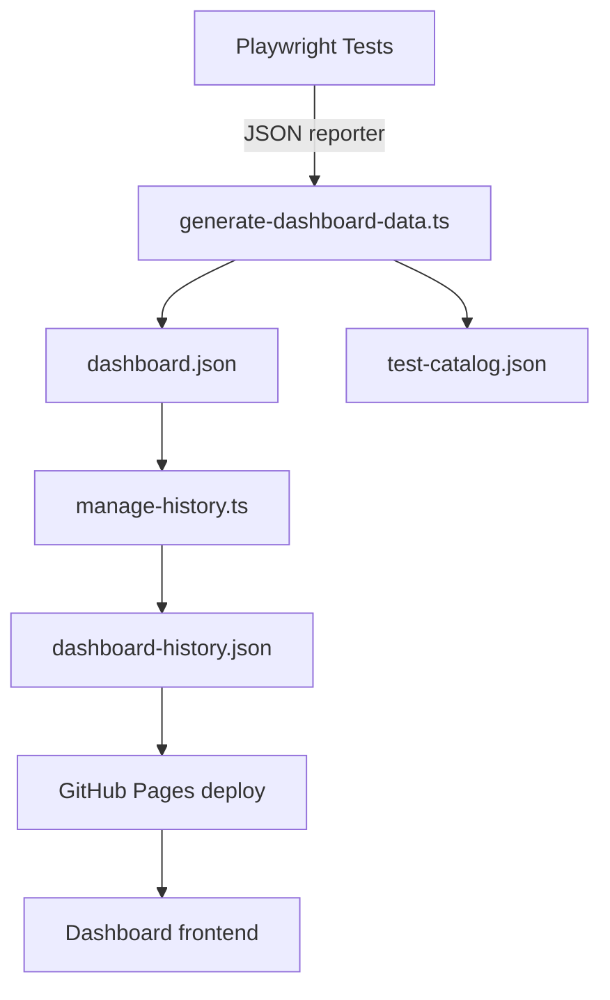
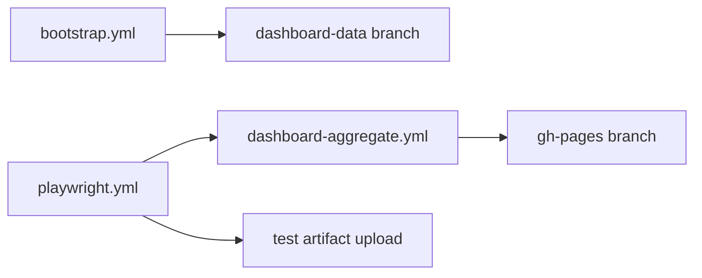
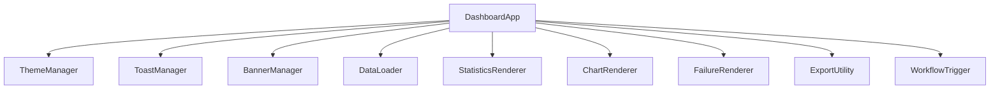
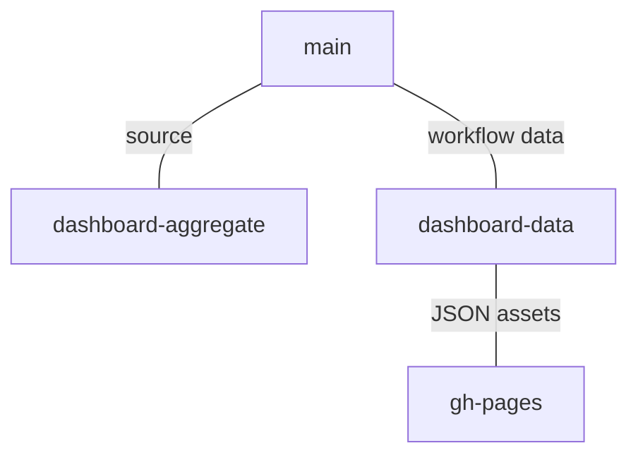

# Dashboard Architecture

## Data Flow

```mermaid
flowchart TD
  A[Playwright Tests] -->|JSON reporter| B[generate-dashboard-data.ts]
  B --> C[dashboard.json]
  B --> D[test-catalog.json]
  C --> E[manage-history.ts]
  E --> F[dashboard-history.json]
  F --> G[GitHub Pages deploy]
  G --> H[Dashboard frontend]
```

## Workflow Chain

```mermaid
flowchart LR
  A[bootstrap.yml] --> B[dashboard-data branch]
  C[playwright.yml] --> D[dashboard-aggregate.yml]
  C --> E[test artifact upload]
  D --> F[gh-pages branch]
```

## Frontend Component Map

```mermaid
flowchart TD
  App[DashboardApp] --> Theme[ThemeManager]
  App --> Toast[ToastManager]
  App --> Banner[BannerManager]
  App --> Loader[DataLoader]
  App --> Stats[StatisticsRenderer]
  App --> Charts[ChartRenderer]
  App --> Failure[FailureRenderer]
  App --> Export[ExportUtility]
  App --> Trigger[WorkflowTrigger]
```

## Branch Strategy

```mermaid
flowchart TD
  main ---|source| dashboard-aggregate
  main ---|workflow data| dashboard-data
  dashboard-data ---|JSON assets| gh-pages
```
